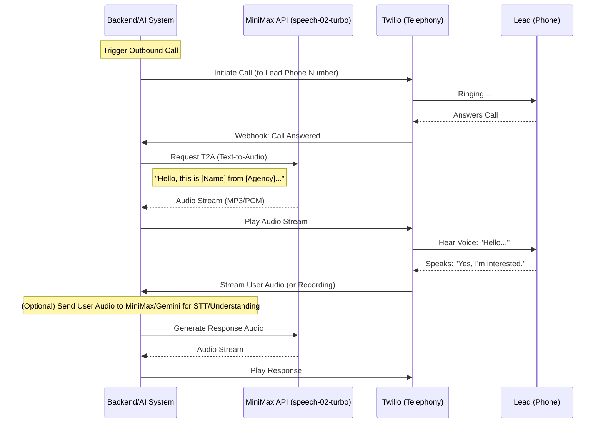

# AI Lead IQ Architecture

## System Overview
The AI Lead IQ system is a Node.js/Express backend that automates real estate lead qualification using AI agents.

### Core Components
1.  **Backend API (Express.js)**: Handles client requests, orchestrates AI services, and manages data.
2.  **Database (Supabase)**: Stores lead information, call logs, and scoring results.
3.  **Voice AI (MiniMax)**: Provides Text-to-Speech (TTS) and Speech-to-Text (STT) capabilities for natural voice interactions.
    *   **Model**: `speech-02-turbo` (Low latency, high quality).
4.  **Lead Scoring (Gemini)**: Analyzes lead data and conversation transcripts to score lead potential.
5.  **Telephony (Twilio)**: *[Planned]* Connects the AI voice stream to the public telephone network (PSTN).

## Data Flow

1.  **Lead Ingestion**: User adds a lead via API -> Stored in Supabase.
2.  **Scoring (Pre-call)**: Gemini analyzes lead details -> Updates lead score in Supabase.
3.  **Outbound Call**:
    *   System initiates call via Twilio.
    *   Twilio connects to MiniMax (or backend proxy).
    *   Conversation loop begins.
4.  **Post-Call Analysis**:
    *   Transcript sent to Gemini.
    *   Gemini updates lead score and qualification status.

## MiniMax Voice Flow (Text -> TTS -> Call)

This flow details how the system handles an outbound call using MiniMax for voice generation.

### Key Integration Details
*   **MiniMax API**: Used for generating the AI voice. We send text prompts and receive audio buffers.
*   **Twilio Media Streams**: For real-time interaction, we will likely use Twilio Media Streams to pipe audio back and forth between the phone line and our backend/MiniMax.
*   **Latency Optimization**: Use `speech-02-turbo` to minimize the delay between the user stopping speaking and the AI responding.
